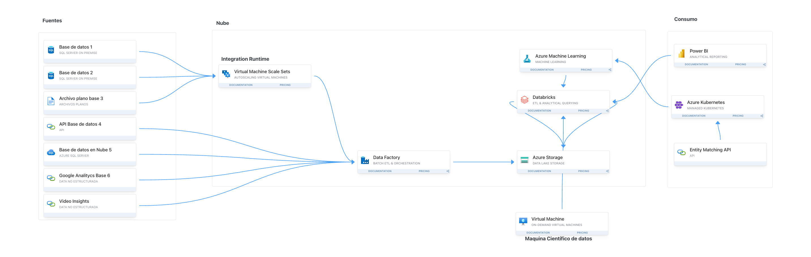

# Architecture for a productive deployment

## Description
Lakehouse with its unification of data store and standardization on Delta Lake format allows you to eliminate silos, remove data duplication, and drastically reduce total cost of ownership. Databricks is a solution to process big data in parallel.

With the flexibility offered by Apache Spark, you can implement either lakehouse or data warehouse architectures or combine them together to get the best of both with simple implementation. It uses the medallion architecture where the bronze layer has the raw data, the silver layer has the validated and deduplicated data, and the gold layer has highly refined data. You can take the same approach to implement a lakehouse for any organization from any industry.

You can use Azure Machine Learning to make experiments and manage deployments for models in Real-time evaluation or manage to process evaluation in batch with Databricks.

Data Factory is a solution to orquestrate and move data from On-premises or cloud sources to storage accounts.

You can use Power BI for reporting purposes and even to consume predictions from your Machine Learning models.